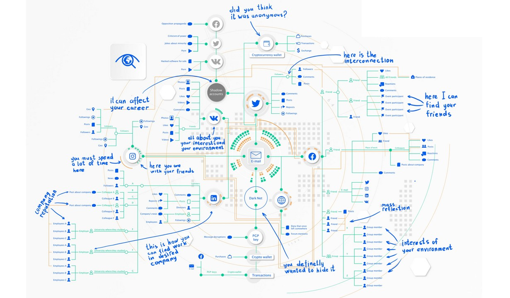

# 🧠 OSINT DATABASE (France / International)
  

  

  

## 📑 Table des matières

- [🕵️‍♂️ OSINT Ressources](#osint-ressources)
  - [✍️ Articles](#articles)
  - [🧭 Méthodes](#methodes)
  - [📚 Livres (EN)](#livres-en)
  - [🖼️ Slides / PDF (FR)](#slides-pdf-fr)
  - [📄 Slides / PDF (EN)](#slides-pdf-en)
  - [🎥 Vidéos](#videos)
  - [🧰 Tools](#tools)
  - [🔍 Other Sources](#other-sources)
    
- [🕵️‍♂️ OSINT Communauté](#osint-communaute)
  - [🇫🇷 Communautés FR](#communautes-fr)
  - [🌍 Communautés EN](#communautes-en)
    
- [🕵️‍♂️ OSINT Formations](#osint-formations)
  - [🎓 Formations gratuites](#formations-gratuites)
  - [💼 Formations / certifications payantes](#formations--certifications-payantes)
  - [🕹️ Challenges FR](#challenges-fr)
  - [🧩 Plateformes](#plateformes)
    
- [🕵️‍♂️ OSINT Jobs](#osint-jobs)
  - [🇫🇷 Entreprises françaises spécialisées en OSINT](#entreprises-francaises-specialisees-en-osint)
  - [🌍 Entreprises internationales spécialisées en OSINT](#entreprises-internationales-specialisees-en-osint)
  - [🏢 Recherche Emploi](#recherche-emploi)
  - [🎖️ Bonus](#bonus)

 

# 🕵️‍♂️ OSINT Ressources
 

## ✍️ Articles
- [Fiche métier FR](https://guardia.school/metiers/osint-analyst.html)
- [Fiche métier EN](https://www.wgu.edu/career-guide/information-technology/osint-career.html)

---
 

## 🧭 Méthodes
- [Livre blanc - Le cadre légal OSINT (2023)](https://ozint.eu/contributions/Livre%20blanc-Le%20cadre%20legal%20OSINT-2023.pdf)
- [Présentation OSINT - Tzkuat](https://repo.tzku.at/presentation/OSINT-tzkuat.pdf)
- [Méthodologie OSINT](https://ozint.eu/fiche-pedagogique/methodologie/)
- [Mind map OSINT](https://webbreacher.com/2018/07/12/osint-map/)
- [Strategy Maltego](https://static.maltego.com/cdn/Infographics/12-OSINT-Steps-to-Gather-Online-Evidence.pdf)

---
 

## 📚 Livres (EN)
- [OSINT Handbook (2020)](https://i-intelligence.eu/uploads/public-documents/OSINT_Handbook_2020.pdf)
- [NSA OSINT Handbook (2002)](https://nsarchive2.gwu.edu/NSAEBB/NSAEBB436/docs/EBB-005.pdf)
- [NATO OSINT Handbook v1.2 (2001)](https://archive.org/details/NATOOSINTHandbookV1.2/mode/2up)
- [The Long History of OSINT (2023)](https://www.researchgate.net/publication/371580573_The_long_history_of_OSINT)
- [OSINT Handbook (13$)](https://buymeacoffee.com/notescatalog/e/258542)

---
 

## 🖼️ Slides / PDF (FR)
- [Diaporama OSINT - ENSIB](https://www.enssib.fr/bibliotheque-numerique/documents/72482-diaporama-osint-s-ouvrir-aux-sources-de-l-investigation.pdf)
- [Security Intelligence Handbook (Fr)](https://go.recordedfuture.com/hubfs/ebooks/security-intelligence-handbook-third-edition-fr.pdf)
- [Formation OSINT - Tzkuat](https://repo.tzku.at/documentation/osint/Formation%20OSINT.pdf)
- [OSINT - AEGE](https://www.aege.fr/global/gene/link.php?news_link=2022093332_mag-osint-10-aege.pdf&fg=1)

---
 

## 📄 Slides / PDF (EN)
- [OSINT Paper (EN)](https://ceur-ws.org/Vol-3654/short3.pdf)
- [Dangerous Google Hacking Database](https://repo.tzku.at/documentation/osint/Dangerours%20Google%20Hacking%20Database%20and%20Attacks.pdf)
- [OSINT Research Paper](https://papers.ssrn.com/sol3/papers.cfm?abstract_id=5281845)

---
 

## 🎥 Vidéos
- [Vidéo 1](https://www.youtube.com/watch?v=gZXZmHRxDWk)
- [Vidéo 2](https://www.youtube.com/watch?v=GameXsraN8Y)
- [Vidéo 3](https://www.youtube.com/watch?v=jP47EQGpOY8)
- [Vidéo 4](https://www.youtube.com/watch?v=wn-i5bRVJbU)
- [Vidéo 5](https://www.youtube.com/watch?v=qz5lSFS4BYY)

---
 

## 🧰 Tools
- [Outils gratuits OSINT](https://cryptrz.org/wordpress/2025/03/02/quelques-outils-gratuits-pour-de-losint/)
- [500 Outils OSINT](https://start.me/p/0Pqbdg/osint-500-tools?locale=fr)
- [Awesome OSINT (GitHub)](https://github.com/jivoi/awesome-osint)
- [OSINT Framework](https://osintframework.com/)
- [Outils OSINT FR](https://osintfr.com/outils/)
- [OSINT SH](https://osint.sh/)
- [Open Source Surveillance API](https://app.theneo.io/offensive-osint/oss/open-source-surveillance-api)
- [Intel Techniques Tools](https://inteltechniques.com/tools/index.html)
- [Sherlock OSINT Tool](https://github.com/sherlock-project/sherlock)
- [Web Check Tool](https://github.com/Lissy93/web-check)
- [Factscope AI](https://www.factscopeai.com/)
- [Maltego](https://www.maltego.com/)
- [Based Re](https://bf.based.re/)
- [Spatial](https://knowlesys.com/en/articles/focus/geospatial_intelligence/geospatial_open_source_intelligence_investigation_tools.html)

---
 

## 🔍 Other Sources
- [OSINT - Non Typical OSINT guide](https://github.com/OffcierCia/non-typical-OSINT-guide)
- [OPSEC](https://github.com/OffcierCia/Crypto-OpSec-SelfGuard-RoadMap)

---
 

# 🕵️‍♂️ OSINT Communauté
  

## 🇫🇷 Communautés FR

Une communauté dynamique pour passionnés et pros de l'OSINT, avec outils, événements et collaborations. Leur Discord est le cœur des échanges (**16 000+ membres**).

- [Rejoindre Discord OSINTFR](https://discord.com/invite/dWY9sWFKYD)
- [Site OSINTFR](https://osintfr.com/)
- [Chaîne YouTube OSINTFR](https://www.youtube.com/@osintfr/videos)

**DEXY | Community :** Espace francophone pour cybersécurité et OSINT, avec partage d'outils, techniques et entraide entre pros et débutants.  
- [Rejoindre Discord DEXY](https://discord.gg/bDueEj4Dt9)

**Greysky :** QG pour passionnés d'OSINT et cyberdéfense, avec veille, tutos, bots et discussions éthiques.  
- [Rejoindre Discord Greysky](https://discord.gg/daFvd4h6)

**LeakWeb :** Communauté pour partager leaks, astuces OSINT et ressources exclusives.  
- [Rejoindre Discord LeakWeb](https://discord.gg/h5kRYEZKy2)

---
 

## 🌍 Communautés EN

## 🌍 Communautés EN

## 🌍 Communautés EN

- **[OSINT Foundation](https://www.osintfoundation.com/osint/Standards.asp)**  
  Organisation internationale dédiée à la professionnalisation du domaine OSINT.  
  Elle propose des ressources, des standards et des initiatives pour renforcer la reconnaissance du renseignement open source.

- **[Project Owl (Discord)](https://discord.com/invite/projectowl)**  
  Communauté anglophone très active dédiée à la surveillance d’événements mondiaux en temps réel via l’OSINT.  
  Idéale pour apprendre le monitoring et la vérification d’informations sur les réseaux sociaux.

- **[Faytuks News (Discord)](https://discord.com/invite/faytuks)**  
  Espace de veille communautaire centré sur les conflits, la géopolitique et l’actualité internationale.  
  Les membres y partagent des analyses et des vérifications visuelles issues de sources ouvertes.

- **[Overt Operator (Discord)](https://discord.gg/KRxZkejyWS)**  
  Serveur géré par la communauté Overt Operator, spécialisé dans les techniques OSINT, HUMINT et cyber threat intelligence.  
  Discussions techniques, partage de bases de données publiques et exercices pratiques.

- **[OSINTIA (Forum)](https://osintia.com/)**  
  Forum anglophone indépendant pour les analystes OSINT.  
  Espace d’échanges sur les outils, les investigations, la cartographie d’informations et les techniques de collecte de données.

- **[OSINT Ambition Forum](https://forum.osintambition.org/)**  
  Communauté internationale pour chercheurs, analystes et passionnés OSINT.  
  Propose des fils de discussion thématiques, des études de cas et des tutoriels méthodologiques.

- **[HackerSploit Forum – Section OSINT](https://forum.hackersploit.org/c/ostin/32)**  
  Forum éducatif créé par l’équipe HackerSploit.  
  Contient une section dédiée à l’OSINT où sont partagés des outils, des scripts et des guides pour les enquêtes numériques.

- **[Reddit /r/OSINT](https://www.reddit.com/r/OSINT/)**  
  L’un des espaces anglophones les plus actifs sur l’OSINT (100k+ membres).  
  Discussions sur la géolocalisation, la recherche d’identités, la vérification d’images et le recueil de données publiques.

- **[Meetup – Open Source Intelligence (USA)](https://www.meetup.com/topics/osint/us/)**  
  Regroupe plusieurs communautés locales OSINT à travers les États-Unis.  
  Permet de rejoindre des ateliers, conférences ou groupes de travail sur le renseignement open source et la cybersécurité.

---
 

# 🕵️‍♂️ OSINT Formations
  

## 🎓 Formations gratuites
- [The Six Pillars of OSINT](https://osintteam.blog/the-six-pillars-of-osint-documentation-59883c8f5927)
- [Fundamentals of OSINT - Alison](https://alison.com/course/fundamentals-of-open-source-intelligence-osint)
- [Open Source Intelligence - Cybrary](https://www.cybrary.it/course/open-source-intelligence/)
- [Cybersecurity Tools and Practices - edX](https://www.edx.org/course/cybersecurity-tools-and-practices)
- [Géolocaliser une image](https://manufacture-osint.fr/tutoriel-comment-geolocaliser-une-image-avec-losint/)

---
 

## 💼 Formations / certifications payantes
- [Greydynamics](https://greydynamics.com/intelligence-school/)
- [Openfacto](https://openfacto.fr/)
- [CSI](https://shop.csilinux.com/shop/uncategorized/csi-linux-certified-osint-analyst/)
- [Mosse](https://www.mosse-institute.com/certifications/mois-certified-osint-expert.html)
- [Analyste OSINT 1](https://www.tactical-osint-academy.com/analyste-osint-niveau-1)
- [Oteria - Bac+5 Expert en Cybersécurité](https://www.oteria.fr/bac-5-expert-en-cybersecurite/renseignement-et-cybermenaces)
- [PSB Edu - Open Source Intelligence](https://www.psbedu.paris/fr/actus/open-source-intelligence-technique-renseignement-service-intelligence-economique)
- [OSMOSIS Institute](https://osmosisinstitute.org/osc/)
- [SANS - Practical OSINT](https://www.sans.org/cyber-security-courses/practical-open-source-intelligence)

---
 

## 🕹️ Challenges FR
- [ISFRED](https://isfred.fr/)
- [Ozint](https://ozint.eu/)
- [The OSINT Project](https://the-osint-project.fr/)
- [CTF Challenge OSINT](https://ctf.challenge-osint.fr/)

---
 

## 🧩 Plateformes
- [OSINT Industries](https://www.osint.industries/)
- [TraceLab VM](https://www.tracelabs.org/initiatives/osint-vm)
- [TraceLab VM installation](https://github.com/tracelabs/tlosint-vm)
  
---
 

# 🕵️‍♂️ OSINT Jobs
 

## 🇫🇷 Entreprises françaises spécialisées en OSINT
Voici une liste d’entreprises françaises dont l’OSINT (Open Source Intelligence) est le cœur d’activité ou un service majeur.

- **Affinis Conseil** – Renseignement d’affaires, OSINT & HUMINT, veille stratégique. [Site officiel](https://www.affinis-conseil.com)  
- **Redintel** – Plateforme d’analyse OSINT & Darkweb, détection de menaces. [Site officiel](https://www.redintel.fr)  
- **Basileak (par Adacis)** – Solution souveraine d’investigation et d’analyse OSINT. [Site officiel](https://www.adacis.net/solutions/basileak/)  
- **Bearops** – Sécurité offensive, investigations OSINT, audit d’exposition numérique. [Présentation Wikipédia](https://fr.wikipedia.org/wiki/Bearops)  
- **Hacker Privé** – Enquêtes OSINT, réputation numérique, due diligence digitale. [Site officiel](https://www.hackerprive.com)  
- **XMCO (Paris)** – Cybersécurité & OSINT. Analyste Cybercriminalité/Darkweb (CDI). [Site officiel](https://www.xmco.fr)  
- **Ariane Group (Île-de-France)** – Intelligence économique et cybersécurité. [Site officiel](https://www.ariane.group)  
- **Epieos (Paris)** – Leader français en outils OSINT (analyse d’e-mails, métadonnées, etc.). [Site officiel](https://www.epieos.com)  
- **Elephantastic (Île-de-France)** – Enquêtes corporate & anti-fraude, renseignement open source. [Site officiel](https://elephantastic.io/)  
- **Aleph-Networks (Paris)** – Deeptech française, SaaS OSINT & veille sur les zones grises du web. [Site officiel](https://www.aleph-networks.com)  
- **Manufacture Française d'OSINT** – Due diligence, veille stratégique, formation OSINT. [Site officiel](https://manufacture-osint.fr/)  
- **Sopra Steria (France)** – Cybersécurité, analyse de menace & renseignement. [Site officiel](https://www.soprasteria.com)  
- **Vélite (Paris)** – Intelligence économique, investigations corporate, OSINT. [Site officiel](https://www.cabinet-velite.com/cabinet/)  
- **Sahar (Paris)** – Cabinet d’analyse, veille stratégique et OSINT institutionnel. [Site officiel](https://www.sahar.fr)

---
 

## 🌍 Entreprises internationales spécialisées en OSINT
Voici une sélection d’entreprises reconnues à l’international pour leurs services, outils et formations en OSINT (Open Source Intelligence).

- **Greydynamics** – Renseignement stratégique, analyse géopolitique, OSINT & cyber threat intelligence. [Site officiel](https://greydynamics.com/work-with-us/)  
- **SocialLinks** – Suite d’outils OSINT professionnels intégrés à Maltego et i2 Analyst’s Notebook. [Site officiel](https://sociallinks.io/products/sl-professional/i2)  
- **PredictaLab** – Investigations, analyses OSINT et renseignement d’affaires à l’échelle internationale. [Site officiel](https://predictalab.fr/services#investigations)  
- **Molfar OSINT Agency** – Enquêtes, renseignement privé, vérification militaire, formation OSINT (Ukraine / international). [Site officiel](https://molfar.com/en/)  
- **Semantic Visions** – Analyse média, détection de tendances, veille géopolitique & conformité (République tchèque). [Site officiel](https://www.semantic-visions.com/)  
- **OSINT Combine (NexusXplore)** – Logiciels et formations OSINT destinés aux gouvernements et entreprises. [Site officiel](https://www.osintcombine.com/company)  
- **Golden Owl** – Intelligence open source pour due diligence, réputation et analyse de risque. [Site officiel](https://www.golden-owl.eu/)  
- **Global OSINT** – Services globaux : veille concurrentielle, analyse de risques, formation OSINT. [Site officiel](https://globalosint.com/en/our-services-en/)  
- **OSINT Industries (UK)** – Plateforme de renseignement en temps réel pour les secteurs gouvernementaux et privés. [Site officiel](https://www.internationalsecurityexpo.com/exhibitors/osint-industries)  
- **Farallon, LLC (USA)** – Investigations et analyse OSINT multi-sources, due diligence, monitoring réputationnel. [Site officiel](https://farallon.io/)  
- **TextOre** – Analyse stratégique et géopolitique, opérations d’influence, veille multilingue. [Site officiel](https://www.textore.net/about/)

---
 

## 🏢 Recherche Emploi
- **Osint-Jobs**. [Site officiel](https://www.osint-jobs.com/)
- **Osintinvestigations**. [Site officiel](https://www.osintinvestigations.fr/emplois/)
- **Indeed**. [Site officiel](https://fr.indeed.com/q-osint-emplois.html?vjk=2d0ae8b1a6b89c36)
- **Glassdoor**. [Site officiel](https://www.glassdoor.fr/Emploi/osint-emplois-SRCH_KO0,5.htm)

---
 

## 🎖️ Bonus
- **DRPP**. [Site officiel](https://www.google.com/url?sa=t&source=web&rct=j&opi=89978449&url=https://choisirleservicepublic.gouv.fr/offre-emploi/drpp---enqueteur-en-sources-ouvertes----osint-hf-hf-reference-MINT_BA075PNB-110202/&ved=2ahUKEwilsoPmtYqQAxWzRqQEHQ1IOHQQFnoECBoQAw&usg=AOvVaw0D1qFPQwZcqLewUYmEwp-9)
- **TRACFIN**. [Site officiel](https://choisirleservicepublic.gouv.fr/offre-emploi/tracfin---analyste--lutte-contre-les-ingerences-etrangeres--hf-reference-MEF_2025-24501/)
- **DGSI**. [Site officiel](https://www.dgsi.interieur.gouv.fr/travailler-a-dgsi/candidater)
- **DRM**. [Site officiel](https://www.defense.gouv.fr/drm/rejoignez-nous/recrutement-civils)
- **DGSE**. [Site officiel](https://www.dgse.gouv.fr/fr/le-recrutement/nous-rejoindre)

  

---

> 📌 *Dernière mise à jour : Octobre 2025*  
> _Contributions bienvenues via Pull Request._
