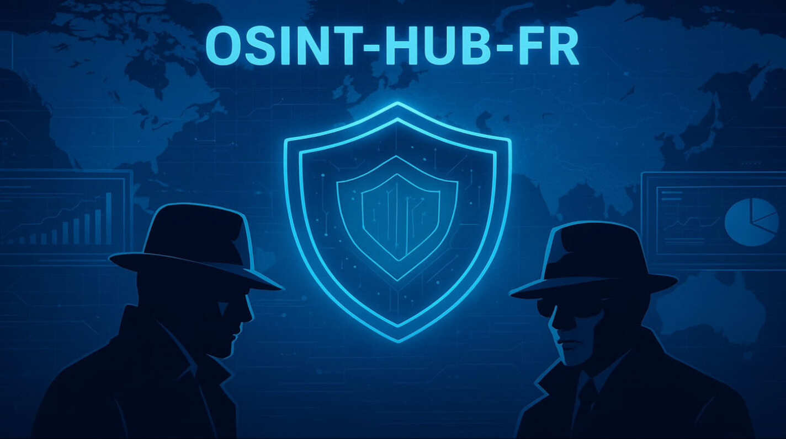
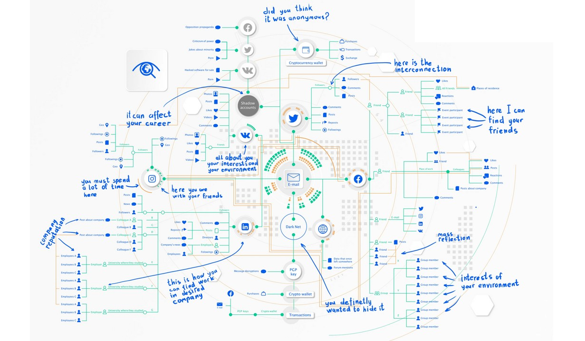

# 🕵️‍♂️ OSINT-HUB-FR 
  

  

  

Le projet <strong>OSINT-HUB-FR</strong> est une <strong>ressource</strong> pensée pour les <strong>étudiants</strong> et les <strong>débutants</strong> : il rassemble des <strong>outils</strong>, des <strong>méthodes</strong> et des <strong>guides pas à pas</strong> en français et parfois en anglais pour apprendre à collecter, analyser et vérifier des informations accessibles publiquement, le tout de manière <strong>éthique, progressive et pédagogique</strong>.

  

  

## 📑 Table des matières

- [🕵️‍♂️ OSINT Ressources](#osint-ressources)
  - [✍️ Articles](#articles)
  - [🧭 Méthodes](#methodes)
  - [📚 Livres (EN)](#livres-en)
  - [🖼️ Slides / PDF (FR)](#slides-pdf-fr)
  - [📄 Slides / PDF (EN)](#slides-pdf-en)
  - [🎥 Vidéos](#videos)
  - [🧰 Tools](#tools)
  - [🧩 Plateformes](#plateformes)
  - [🔍 Autre Sources](#autre-sources)
    
- [🕵️‍♂️ OSINT Communauté](#osint-communaute)
  - [🇫🇷  Communautés FR](#communautes-fr)
  - [🌍 Communautés EN](#communautes-en)
    
- [🕵️‍♂️ OSINT Formations](#osint-formations)
  - [🎓 Formations gratuites](#formations-gratuites)
  - [💼 Formations / certifications payantes](#formations--certifications-payantes)
  - [🕹️ Challenges FR](#challenges-fr)
  - [🕹️ Challenges EN](#challenges-en)
  - [🧩 Plateformes](#plateformes)
    
- [🕵️‍♂️ OSINT Jobs](#osint-jobs)
  - [🇫🇷 Entreprises françaises spécialisées en OSINT](#entreprises-francaises-specialisees-en-osint)
  - [🌍 Entreprises internationales spécialisées en OSINT](#entreprises-internationales-specialisees-en-osint)
  - [🏢 Recherche Emploi](#recherche-emploi)
  - [🎖️ Bonus](#bonus)

 

# 🧠 OSINT Ressources
 

## ✍️ Articles
- [Fiche métier FR](https://guardia.school/metiers/osint-analyst.html)
- [Fiche métier EN](https://www.wgu.edu/career-guide/information-technology/osint-career.html)
- [The ultimate OSINT Career guide](https://preciousvincentct.medium.com/the-ultimate-guide-to-launching-a-career-in-open-source-intelligence-osint-from-beginner-to-0b3dd09ec88f)
- [The Six Pillars of OSINT](https://osintteam.blog/the-six-pillars-of-osint-documentation-59883c8f5927)
- [Dutchosintguy](https://www.dutchosintguy.com/post/beyond-dashboards-osint-s-next-two-decades)
- [Géolocaliser une image](https://manufacture-osint.fr/tutoriel-comment-geolocaliser-une-image-avec-losint/)
- [Acceder au information publique FR](https://gijn.org/fr/histoires/comment-acceder-a-des-informations-publiques-en-france/)
- [Nothing2hide/osint](https://wiki.nothing2hide.org/doku.php?id=start&do=index)
- [Maltego tuto](https://wondersmithrae.medium.com/a-beginners-guide-to-osint-investigation-with-maltego-6b195f7245cc)
  
---
 

## 🧭 Méthodes
- [Livre blanc - Le cadre légal OSINT (2023)](https://ozint.eu/contributions/Livre%20blanc-Le%20cadre%20legal%20OSINT-2023.pdf)
- [Guide OSINT (2019)](https://maynier.eu/blog/2019/01/05/2019-osint-guide/)
- [Méthodologie OSINT](https://ozint.eu/fiche-pedagogique/methodologie/)
- [Comprendre l’OSINT](https://www.oteria.fr/blog-oteria/osint-atout-renseignement-cybermenaces)
- [Mind map OSINT](https://webbreacher.com/2018/07/12/osint-map/)
- [Strategy Maltego](https://static.maltego.com/cdn/Infographics/12-OSINT-Steps-to-Gather-Online-Evidence.pdf)

---
 

## 📚 Livres (EN)
- [OSINT Handbook (2020)](https://i-intelligence.eu/uploads/public-documents/OSINT_Handbook_2020.pdf)
- [NSA OSINT Handbook (2002)](https://nsarchive2.gwu.edu/NSAEBB/NSAEBB436/docs/EBB-005.pdf)
- [NATO OSINT Handbook v1.2 (2001)](https://archive.org/details/NATOOSINTHandbookV1.2/mode/2up)
- [The Long History of OSINT (2023)](https://www.researchgate.net/publication/371580573_The_long_history_of_OSINT)
- [OSINT Handbook (13$)](https://buymeacoffee.com/notescatalog/e/258542)

---
 

## 🖼️ Slides / PDF (FR)
- [Présentation OSINT - Tzkuat](https://repo.tzku.at/presentation/OSINT-tzkuat.pdf)
- [Diaporama OSINT - ENSIB](https://www.enssib.fr/bibliotheque-numerique/documents/72482-diaporama-osint-s-ouvrir-aux-sources-de-l-investigation.pdf)
- [Security Intelligence Handbook (Fr)](https://go.recordedfuture.com/hubfs/ebooks/security-intelligence-handbook-third-edition-fr.pdf)
- [Formation OSINT - Tzkuat](https://repo.tzku.at/documentation/osint/Formation%20OSINT.pdf)
- [OSINT - AEGE](https://www.aege.fr/global/gene/link.php?news_link=2022093332_mag-osint-10-aege.pdf&fg=1)

---
 

## 📄 Slides / PDF (EN)
- [OSINT Paper (EN)](https://ceur-ws.org/Vol-3654/short3.pdf)
- [Dangerous Google Hacking Database](https://repo.tzku.at/documentation/osint/Dangerours%20Google%20Hacking%20Database%20and%20Attacks.pdf)
- [OSINT Research Paper](https://papers.ssrn.com/sol3/papers.cfm?abstract_id=5281845)

---
 

## 🎥 Vidéos & Podcast
- [Osintcurio](https://www.osintcurio.us/osintvideosandpodcasts/index.htm) 
- [OSINT ANALYST : missions, salaire, compétences et formations](https://www.youtube.com/watch?v=gZXZmHRxDWk) 
- [Introduction à l’OSINT : maîtrisez l'art de l'investigation en ligne](https://www.youtube.com/watch?v=GameXsraN8Y)
- [OSINT : dans la peau d'un hacker](https://www.youtube.com/watch?v=jP47EQGpOY8)
- [Top 10 des Outils OSINT GRATUITS Pour 2025 (Effrayant)](https://www.youtube.com/watch?v=qz5lSFS4BYY)

---
 

## 🧰 Tools
- [Outils OSINT FR](https://osintfr.com/outils/)
- [OSINT Tools matrix](https://docs.google.com/spreadsheets/d/1HB53MTsJsl_hKkd2eJYIkQ1v-BsaSKU6h25YE5zP-6k/edit?gid=0#gid=0)
- [Osint tool](https://osint.tools/)
- [Osint combine](https://www.osintcombine.com/tools)
- [Outils gratuits OSINT](https://cryptrz.org/wordpress/2025/03/02/quelques-outils-gratuits-pour-de-losint/)
- [OCCRP/Database](https://id.occrp.org/databases/)
- [Awesome OSINT - GitHub](https://github.com/jivoi/awesome-osint)
- [OSINT Framework](https://osintframework.com/)
- [Osint / Threat intelligence tool/](https://maynier.eu/blog/2018/02/23/harpoon-an-osint-/-threat-intelligence-tool/)
- [OSINT SH](https://osint.sh/)
- [Digital protection guides comparison](https://docs.google.com/spreadsheets/d/1LOc6SOJGWymaN4P1hc8ln3Zp-aGob_eKSr9B6MJ6ReE/edit?gid=519861083#gid=519861083)
- [Open Source Surveillance API](https://app.theneo.io/offensive-osint/oss/open-source-surveillance-api)
- [Intel Techniques Tools](https://inteltechniques.com/tools/index.html)
- [Sherlock OSINT Tool - GitHub](https://github.com/sherlock-project/sherlock)
- [Web Check Tool - GitHub](https://github.com/Lissy93/web-check)
- [Factscope AI](https://www.factscopeai.com/)
- [Maltego](https://www.maltego.com/)
- [Based Re](https://bf.based.re/)
- [Archive youtube](https://preservetube.com/)
- [Spatial](https://knowlesys.com/en/articles/focus/geospatial_intelligence/geospatial_open_source_intelligence_investigation_tools.html)
- [Le kit](https://kit.exposingtheinvisible.org/fr/thekit.html)
- [Zoomeye](https://www.zoomeye.ai/)
- [Osint4all - Start.me](https://start.me/p/L1rEYQ/osint4all)
- [Toolbox - Start.me](https://start.me/p/7krOpx/toolbox)
- [Darkint - Start.me](https://start.me/p/19k4MD/darkint)
- [500 Outils OSINT - Start.me](https://start.me/p/0Pqbdg/osint-500-tools?locale=fr)
- [Dehashed](https://dehashed.com/data-wells)
- [Chromewebstore](https://chromewebstore.google.com/detail/clean-tabs/aghbkaaajenibjoinlhcpcobnboebhme)
- [liveuamap](https://liveuamap.com/)
- [Manhole](https://manhole.co.il/coversMap.asp?sr=all%3D1)
  
---
 

## 🧩 Plateformes
- [OSINT Industries](https://www.osint.industries/)
- [Itnelowlprojet](https://intelowlproject.github.io/)
- [TraceLab VM](https://www.tracelabs.org/initiatives/osint-vm)
- [TraceLab VM installation](https://github.com/tracelabs/tlosint-vm)

---
 

## 🔍 Autres Sources
- [OSINT - Non Typical OSINT guide](https://github.com/OffcierCia/non-typical-OSINT-guide)
- [OSINT - Google Drive](https://drive.google.com/drive/folders/1CBcemFdorkAqJ-Sthsh67OVHgH4FQF05)
- [OPSEC](https://github.com/OffcierCia/Crypto-OpSec-SelfGuard-RoadMap)

---
 

# 🕵️‍♂️ OSINT Communauté
  

## 🇫🇷 Communautés FR

- **[OSINTFR](https://osintfr.com/)** 🟢 **Actif**  
  La principale communauté francophone OSINT.  
  Avec plus de **16 000 membres** sur Discord.  
  Ce serveur est très actif et structuré autour des échanges, des formations, des défis collaboratifs, et de la veille.  
  - 🔗 [Rejoindre le Discord OSINTFR](https://discord.com/invite/dWY9sWFKYD)  
  - ▶️ [Chaîne YouTube OSINTFR](https://www.youtube.com/@osintfr/videos)

- **[DEXY | Community](https://discord.gg/bDueEj4Dt9)** 🟢 **Actif**  
  Communauté francophone centrée sur l’OSINT et la cybersécurité.  
  Entraide entre amateurs et professionnels, partage d’outils, méthodologies et retours d’expérience.

- **[Greysky (Discord)](https://discord.gg/daFvd4h6)** 🟢 **Actif**  
  Serveur francophone dédié à l’OSINT, à la cyberdéfense et à la veille technique.  
  Tutos, bots, discussions éthiques sont parmi les usages fréquemment cités.

- **[LeakWeb (Discord)](https://disboard.org/fr/server/1371773770741583872)** 🟠 **Peu actif**  
  Communauté axée sur le partage de leaks, l’exposition de données publiques et l’OSINT technique.  
  Intéressant pour les analystes cherchant des ressources “dures” et des techniques avancées.

- **[OSINT PROTECT FR (Discord)](https://discord.gg/h3uwNRbCvQ)** 🔴 **À vérifier**  
  Communauté orientée “protection mutuelle par l’OSINT”.  
  Le serveur offre des canaux de discussion sur l’OSINT, le signalement d’incidents et la résilience numérique.  
  Activité incertaine ces derniers mois.

- **[Club OSINT & Veille – AEGE (Discord)](https://discord.com/invite/GrEFhBCbVV)** 🟠 **Peu actif**  
  Initiative d’une association d’étudiants/ingénieurs (AEGE).  
  Objectif : créer un espace francophone d’OSINT / veille, de challenges internes et de partage d’actualités.  
  À vérifier, activité variable selon les périodes académiques.

- **[OSINTOPIA / OZINT (Plateforme + communauté)](https://ozint.eu/)** 🟢 **Actif**  
  Plateforme francophone d’OSINT, proposant des articles, challenges et espaces collaboratifs.  
  Souvent citée comme référence communautaire.  
  Vérifie s’ils ont un Discord ou des groupes de discussion associés.

---
 

## 🌍 Communautés EN

- **[OSINT Foundation](https://www.osintfoundation.com/osint/Standards.asp)** 🟢 **Actif**  
  Organisation internationale dédiée à la professionnalisation du domaine OSINT.  
  Propose des ressources, standards et initiatives pour renforcer la reconnaissance du renseignement open source.

- **[Project Owl (Discord)](https://discord.com/invite/projectowl)** 🟢 **Actif**  
  Communauté anglophone très active dédiée à la surveillance d’événements mondiaux via l’OSINT.  
  Idéale pour apprendre le monitoring et la vérification d’informations sur les réseaux sociaux.

- **[Faytuks News (Discord)](https://discord.com/invite/faytuks)** 🟢 **Actif**  
  Espace de veille communautaire centré sur les conflits, la géopolitique et l’actualité internationale.  
  Les membres y partagent des analyses et vérifications visuelles issues de sources ouvertes.

- **[Overt Operator (Discord)](https://discord.gg/KRxZkejyWS)** 🟢 **Actif**  
  Communauté orientée sur les techniques OSINT, HUMINT et cyber threat intelligence.  
  Discussions techniques, partage de bases de données et exercices pratiques.

- **[OSINTIA (Forum)](https://osintia.com/)** 🟠 **Peu actif**  
  Forum anglophone indépendant pour analystes OSINT.  
  Espace d’échanges sur les outils et la cartographie d’informations, mais peu d’activité récente.

- **[OSINT Ambition Forum](https://forum.osintambition.org/)** 🔴 **À vérifier**  
  Communauté internationale pour chercheurs et passionnés OSINT.  
  L’activité du forum semble limitée ces derniers temps.

- **[HackerSploit Forum – Section OSINT](https://forum.hackersploit.org/c/ostin/32)** 🟠 **Peu actif**  
  Forum éducatif créé par l’équipe HackerSploit.  
  Contient une section OSINT utile, mais les discussions sont sporadiques.

- **[Reddit /r/OSINT](https://www.reddit.com/r/OSINT/)** 🟢 **Actif**  
  L’un des espaces anglophones les plus actifs sur l’OSINT (100k+ membres).  
  Discussions variées sur la géolocalisation, la recherche d’identités et la vérification d’images.

- **[Meetup – Open Source Intelligence (USA)](https://www.meetup.com/topics/osint/us/)** 🟢 **Actif**  
  Regroupe plusieurs communautés locales OSINT à travers les États-Unis.  
  Permet de participer à des ateliers, conférences et rencontres OSINT locales.

---

# 🕵️‍♂️ OSINT Formations
 

## 🎓 Formations gratuites
- [Osint4fun](https://www.osint4fun.eu/challenges/)
- [Fundamentals of OSINT - Alison](https://alison.com/course/fundamentals-of-open-source-intelligence-osint)
- [Introduction to OSINT](https://www.securityblue.team/courses/introduction-to-osint)
- [Open Source Intelligence - Cybrary](https://www.cybrary.it/course/osint-fundamentals)
- [Open-source Intelligence](https://training.kapsuungroup.com/courses/osint-beginners-course)
- [OSINT Mini](https://courses.thecyberinst.org/courses/osintmini)
- [CaseFile](https://courses.thecyberinst.org/courses/casefile)
- [Social Media Research](https://learn.totem-project.org/courses/course-v1:Totem+TP_SMR_EN+001/about)
- [Dark Web Foundations](https://www.darkwebacademy.com/courses/dark-web-foundations)
- [OSINT Beginners Course](https://training.kapsuungroup.com/courses/osint-beginners-course)

---
 

## 💼 Formations payantes
- [Zsecurity](https://zsecurity.org/cosintp/)
- [Greydynamics](https://greydynamics.com/intelligence-school/)
- [Openfacto](https://openfacto.fr/)
- [CSI](https://shop.csilinux.com/shop/uncategorized/csi-linux-certified-osint-analyst/)
- [Mosse](https://www.mosse-institute.com/certifications/mois-certified-osint-expert.html)
- [Analyste OSINT 1](https://www.tactical-osint-academy.com/analyste-osint-niveau-1)
- [Oteria - Bac+5 Expert en Cybersécurité](https://www.oteria.fr/bac-5-expert-en-cybersecurite/renseignement-et-cybermenaces)
- [PSB Edu - Open Source Intelligence](https://www.psbedu.paris/fr/actus/open-source-intelligence-technique-renseignement-service-intelligence-economique)
- [OSMOSIS Institute](https://osmosisinstitute.org/osc/)
- [SANS - Practical OSINT](https://www.sans.org/cyber-security-courses/practical-open-source-intelligence)

---
 

## 🕹️ Challenges FR

- **[ISFRED](https://isfred.fr/)** 🟢 **Actif**  
  Plateforme française de formation et de challenges OSINT.  
  Propose des parcours pédagogiques et des énigmes progressives autour de la recherche d’informations ouvertes.

- **[Osintopia / OZINT](https://ozint.eu/)** 🟢 **Actif**  
  Plateforme communautaire francophone dédiée à l’OSINT, regroupant des articles, formations et challenges pratiques à résoudre seul ou en équipe.

- **[The OSINT Project](https://the-osint-project.fr/)** 🟠 **Peu actif**  
  Projet français proposant des défis OSINT, des ressources méthodologiques et des études de cas collaboratives.  
  Les challenges sont parfois ponctuels (vérifier la section “Événements”).

- **[CTF Challenge OSINT](https://ctf.challenge-osint.fr/)** 🟢 **Actif**  
  Instance CTF francophone dédiée exclusivement à l’OSINT.  
  Organisée par la communauté OSINT-FR, elle propose des scénarios réguliers et un classement public.

- **[PredictaLab CTF](https://ctf.predictalab.fr/)** 🔴 **À vérifier**  
  Plateforme française qui a hébergé des CTF et exercices OSINT à vocation pédagogique.  
  Le site reste en ligne, mais l’activité semble irrégulière ces derniers mois.

- **[Oscar Zulu](https://osint.oscarzulu.org)** 🟢 **Actif**  
  Plateforme d’OSINT proposant des challenges / enquêtes numériques (CTF) pour exercer ses compétences en recherche d’informations ouvertes.
  Permet à la fois de s’inscrire, de s’authentifier, de progresser dans un scoreboard, et de participer à des investigations très variées, dans différents langues.
---

## 🕹️ Challenges EN

- **[Trace Labs — Search Party CTF](https://www.tracelabs.org/initiatives/search-party)** 🟢 **Actif**  
  Organisation OSINT internationale à but non lucratif.  
  Organise régulièrement des CTF basés sur des enquêtes réelles de personnes disparues — “OSINT for good”.

- **[OSINT For All — The Unsolvable CTF](https://osintforall.in/ctf/)** 🟠 **Peu actif**  
  Projet communautaire proposant des énigmes et investigations OSINT.  
  Moins de mises à jour récentes mais toujours en ligne avec des ressources intéressantes.

- **[OSINT4Fun — Exercises & Advent Challenges](https://en.osint4fun.eu/)** 🟢 **Actif**  
  Site de défis OSINT en ligne (énigmes, images, coordonnées, etc.)  
  Publie régulièrement de nouveaux challenges (séries “Advent Calendar”).

- **[List of OSINT Exercises — Gralhix](https://gralhix.com/list-of-osint-exercises/)** 🟢 **Actif**  
  Agrégateur de plateformes et CTF OSINT mondiaux (liens directs vers des défis actifs).  
  Bon point de départ pour trouver d’autres challenges anglophones.

- **[Maveris / OSINT CTFs & Write-ups](https://infosecwriteups.com/maveris-osint-ctf-2024-writeup-1a18fcd66cb3)** 🟠 **Peu actif**  
  Challenges ponctuels organisés par Maveris, NahamCon, etc.  
  Activité non régulière mais write-ups très utiles pour s’entraîner sur des cas réels.

---
 

# 🕵️‍♂️ OSINT Jobs
 

## 🇫🇷 Entreprises françaises spécialisées en OSINT
Voici une liste d’entreprises françaises dont l’OSINT est le cœur d’activité ou un service majeur.

- **Affinis Conseil** – Renseignement d’affaires, OSINT & HUMINT, veille stratégique. [Site officiel](https://www.affinis-conseil.com)  
- **Redintel** – Plateforme d’analyse OSINT & Darkweb, détection de menaces. [Site officiel](https://www.redintel.fr)  
- **Basileak (par Adacis)** – Solution souveraine d’investigation et d’analyse OSINT. [Site officiel](https://www.adacis.net/solutions/basileak/)  
- **Bearops** – Sécurité offensive, investigations OSINT, audit d’exposition numérique. [Présentation Wikipédia](https://fr.wikipedia.org/wiki/Bearops)  
- **Hacker Privé** – Enquêtes OSINT, réputation numérique, due diligence digitale. [Site officiel](https://www.hackerprive.com)  
- **XMCO (Paris)** – Cybersécurité & OSINT. Analyste Cybercriminalité/Darkweb (CDI). [Site officiel](https://www.xmco.fr)  
- **Ariane Group (Île-de-France)** – Intelligence économique et cybersécurité. [Site officiel](https://www.ariane.group)  
- **Epieos (Paris)** – Leader français en outils OSINT (analyse d’e-mails, métadonnées, etc.). [Site officiel](https://www.epieos.com)  
- **Elephantastic (Île-de-France)** – Enquêtes corporate & anti-fraude, renseignement open source. [Site officiel](https://elephantastic.io/)  
- **Aleph-Networks (Paris)** – Deeptech française, SaaS OSINT & veille sur les zones grises du web. [Site officiel](https://www.aleph-networks.com)  
- **Manufacture Française d'OSINT** – Due diligence, veille stratégique, formation OSINT. [Site officiel](https://manufacture-osint.fr/)  
- **Sopra Steria (France)** – Cybersécurité, analyse de menace & renseignement. [Site officiel](https://www.soprasteria.com)  
- **Vélite (Paris)** – Intelligence économique, investigations corporate, OSINT. [Site officiel](https://www.cabinet-velite.com/cabinet/)  
- **Sahar (Paris)** – Cabinet d’analyse, veille stratégique et OSINT institutionnel. [Site officiel](https://www.sahar.fr)
---
 

## 🌍 Entreprises internationales spécialisées en OSINT
Voici une sélection d’entreprises reconnues à l’international pour leurs services, outils et formations en OSINT.

- **Greydynamics** – Renseignement stratégique, analyse géopolitique, OSINT & cyber threat intelligence. [Site officiel](https://greydynamics.com/work-with-us/)  
- **SocialLinks** – Suite d’outils OSINT professionnels intégrés à Maltego et i2 Analyst’s Notebook. [Site officiel](https://sociallinks.io/products/sl-professional/i2)  
- **PredictaLab** – Investigations, analyses OSINT et renseignement d’affaires à l’échelle internationale. [Site officiel](https://predictalab.fr/services#investigations)  
- **Molfar OSINT Agency** – Enquêtes, renseignement privé, vérification militaire, formation OSINT (Ukraine / international). [Site officiel](https://molfar.com/en/)  
- **Semantic Visions** – Analyse média, détection de tendances, veille géopolitique & conformité (République tchèque). [Site officiel](https://www.semantic-visions.com/)  
- **OSINT Combine (NexusXplore)** – Logiciels et formations OSINT destinés aux gouvernements et entreprises. [Site officiel](https://www.osintcombine.com/company)  
- **Golden Owl** – Intelligence open source pour due diligence, réputation et analyse de risque. [Site officiel](https://www.golden-owl.eu/)  
- **Global OSINT** – Services globaux : veille concurrentielle, analyse de risques, formation OSINT. [Site officiel](https://globalosint.com/en/our-services-en/)  
- **OSINT Industries (UK)** – Plateforme de renseignement en temps réel pour les secteurs gouvernementaux et privés. [Site officiel](https://www.internationalsecurityexpo.com/exhibitors/osint-industries)  
- **Farallon, LLC (USA)** – Investigations et analyse OSINT multi-sources, due diligence, monitoring réputationnel. [Site officiel](https://farallon.io/)  
- **TextOre** – Analyse stratégique et géopolitique, opérations d’influence, veille multilingue. [Site officiel](https://www.textore.net/about/)

---
 

## 🏢 Recherche Emploi
- **Osint-Jobs** [Site officiel](https://www.osint-jobs.com/)
- **Osintinvestigations** [Site officiel](https://www.osintinvestigations.fr/emplois/)
- **Indeed** [Site officiel](https://fr.indeed.com/q-osint-emplois.html?vjk=2d0ae8b1a6b89c36)
- **Glassdoor** [Site officiel](https://www.glassdoor.fr/Emploi/osint-emplois-SRCH_KO0,5.htm)

---

  

# 🎖️ Bonus

## OSINT MAP

Source : https://github.com/SocialLinks-IO/assets/blob/main/Email%20MindMap.jpg
---
  

 
<b>HERMES</b>

> 📌 *Dernière mise à jour : Octobre 2025*  
> _Contributions bienvenues via Pull Request._
